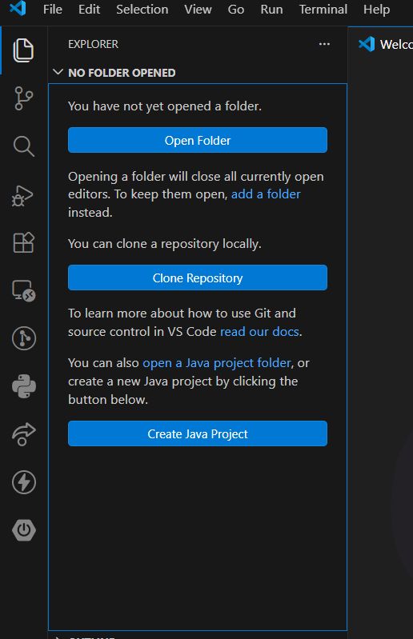
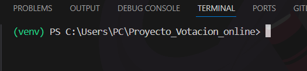
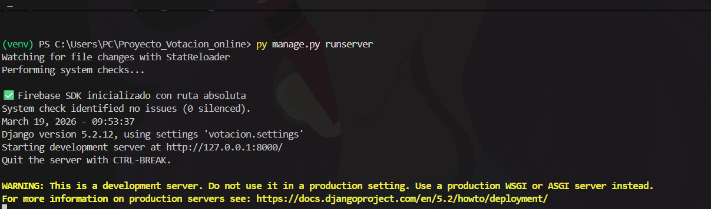

# 🗳️Sistema de votación online

## 1-Descripción de la idea💡:

 El proyecto se basa en una plataforma de votaciones online, que permita crear y participar en votaciones o encuestas de forma digital, para reducir el tiempo de las jornadas de votación.  
 Este sistema podría ser utilizado en:

 - Elecciones estudiantiles
 - Votaciones en cursos
 - Encuestas universitarias
 - Decisiones en grupos de trabajo
 - Consultas populares
 - Votaciones al concejo, alcaldes o incluso para la presidencia y congreso (para la cual se necesitaría una mayor infraestructura y presupuesto)

 ## 2-Requisitos de instalación 💾:
 La versión de python ideal es Python 3.14.0, los démas requisitos de instalación ya están especificados en el archivo requirements.txt, en el que mediante el siguiente código se descargan todas las dependencias y requísitos automáticamente.

<pre>
    pip install -r requirements.txt
</pre>

> [!IMPORTANT] 
> Es necesario haber creado y activado el entorno virtual antes de instalar el requirements.txt

## 3-Guia de instalación 📀:
 Para instalar este proyecto debes seguir los siguientes pasos:

- Primero desde la terminal debes clonar el repositorio 

<pre>
    git clone https://github.com/minostauro27-byte/Proyecto_Votacion_online.git
</pre>

- Luego debemos abrir el proyecto 
---

---

- Abrimos una terminal (Ctrl + shift + ñ ) y creamos el entorno virtual.(en windows)

<pre>
  py -m venv venv
</pre>

- Luego activamos el entorno virtual(en windows)

<pre>
    .\venv\Scripts\activate
</pre>

- Despues de asegurarnos que el entorno se encuentra encendido, lo cual podemos evidenciar en la parte izquierda de la terminal. 
---

---

- Luego instalamos todas las dependecias que nuestro proyecto necesita, con el siguiente comando.

<pre>
    pip install -r requirements.txt 
</pre>

- Ahora estamos casi listos para levantar el servidor, para ello debemos correr los siguientes comandos propios de django.

<pre>py manage.py makemigrations </pre>
<pre>py manage.py migrate </pre>
<pre>py manage.py runserver </pre>

- Y si todo salio bien deberia levantarse el servidor sin problemas.
---

---

## 4-Stack tecnológico 📚:

El backend está desarrollado con Django y Django REST Framework, encargándose de la lógica del sistema, la validación de votos y la gestión de las encuestas mediante una API REST. Para la autenticación se emplea Firebase Authentication, garantizando un acceso seguro y controlado mediante tokens.

La información se almacena en Firebase Firestore , mientras que servicios como Cloudinary permiten gestionar archivos multimedia. Este conjunto de tecnologías ofrece una solución moderna, segura y escalable para la gestión de votaciones en línea.

Tecnológias utilizadas:
- Django
- Django REST Framework
- Firebase Firestore
- Cloudinary
- Git 
- Github
- Visual Studio Code
- Thunder Client
- REST Client

## 5-Documentación de la api 🗃️:
Podrás ver la documentación en el siguiente sitio:
[Documentación_de_la_api](https://drive.google.com/drive/folders/1LgRwSQF8CnA5WSsKxkcP28uZn8lWrLme?usp=sharing)

## 6-Nombres y cuentas 🧑‍💻:

- Maikoll Daniel Torres Fandiño, usuario de github: minostauro27-byte
- Fabian David Torres Fandiño, usuario de github: fabiantfandi-svg
- Kevin Yoel Martinez Clavijo: usuario de github: kevinmartinez13

